# Face Alignment using Convolutional Neural Network

Facial landmark detection acts as a fundamental part of many computer vision applications. It is commonly used for tasks such as facial expression analysis and real-time face tracking, so it needs to be as accurate and fast as possible. Common approaches[^1][^2] suggest training a cascade of regression trees using gradient boosting algorithm and pixel intensity differences as features. Alternatively, this problem can be approached using neural networks, which is the focus of this project. In addition, we will discuss how the detected landmarks can be used for lip and eye colour modification.
****
## Methods

### Data Augmentation

The amount of data in the original dataset may not be enough for proper model generalization. To overcome this problem several data augmentation techniques have been implemented. First, each image is reflected horizontally along with the corresponding landmarks. Random rotations and noise are then applied, and finally brightness shifts and vignette are added. As a result, we get a dataset of 16866 images, which we can now use to train the model.

| 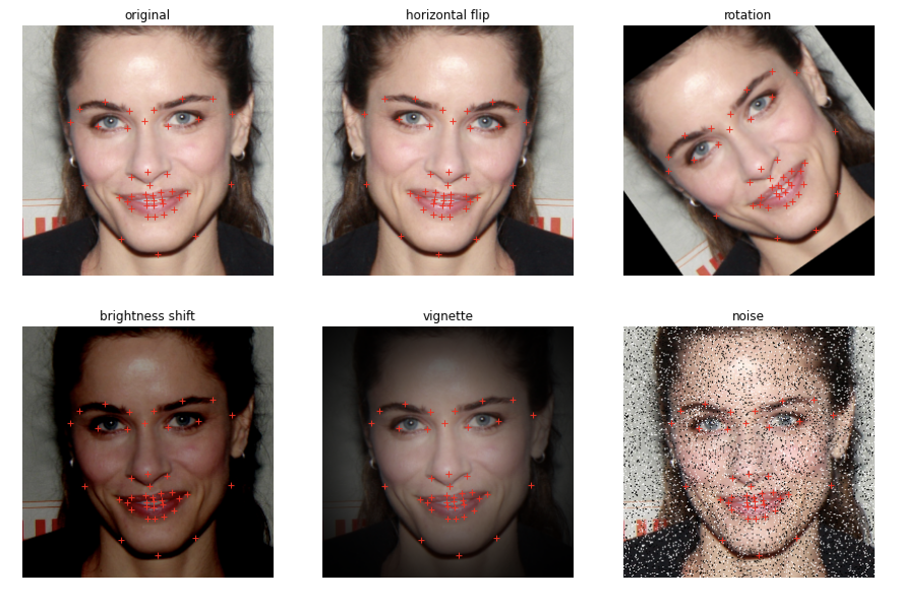 | 
|:--:| 
| Data Augmentation techniques |

### Pre-processing

Before passing our data to the neural network, we need to consider a few techniques to make it more consistent. Since optimizers are sensitive to the feature scale, we need to normalize pixel values so that they end up in the range $0$ to $1$, which can be done by dividing the value of each pixel by $255$. Also, we don't need our images to have a high resolution and we can compress them to a lower one $(96 \times 96)$ to speed up training.

### Facial Landmark Detection

For our experiments, 3 different architectures were used to evaluate which design solutions are more suitable for a given problem. The first approach uses a simple CNN and the other two are based on a pre-trained Inception Model with two dense layers added at the end. We also need to choose an appropriate loss function for our model. The default choice for most regression problems is MSE, which is defined as follows:

$$MSE=\frac{1}{N}(y^{(i)}-\hat{y}^{(i)})^2$$

One way to get better predictions from our model is to stop the learning process if there is no significant increase in accuracy. We can assume that if accuracy does not improve within 10 epochs, this is the best performance we can get and we can stop training.

First approach implies building a basic convolutional network model. Several techniques are used to address overfitting. Batch normalization is applied to normalize the output for each convolutional layer, and dropout with a probability of 0.2 is added to the last convolutional and hidden layer, since these layers have the most trainable parameters and are therefore more likely to cause overfitting.

| 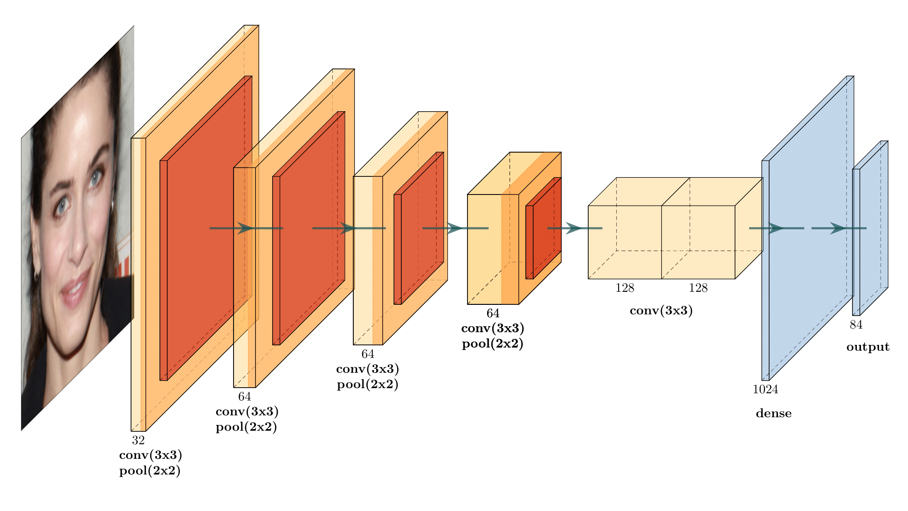 | 
|:--:| 
| CNN Architecture |

One of the main drawbacks of using deep networks is that as the network grows, the number of parameters increases accordingly, making it more prone to overfitting. One way to deal with this is to use filters with different sized kernels at the same level as one module and expand the network in width rather than in depth. This is the general idea behind the Inception network - to stack such modules upon each other with occasional max-pooling layers [^3].

| 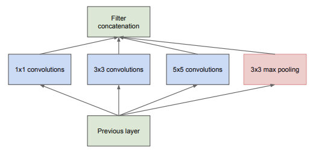 | 
|:--:| 
| Inception naive module. Adapted from Going deeper with convolutions, Szegedy et al., 2015. |

Nevertheless, there is a problem with the naive form because even a small number of 5x5 convolutions can be fairly expensive. Authors suggest an improved architecture by applying dimension reductions with £1 /times 1£ kernels before the expensive convolutions.

| 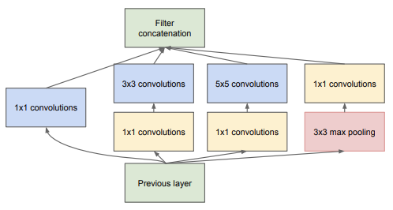 | 
|:--:| 
| Inception module with dimension reduction. Adapted from Going deeper with convolutions, Szegedy et al.,
2015. |

Although the Inception model was originally trained on the classification task, we can use it to extract features from image data and then feed them as input to another model [^4]. In this case, we use one hidden layer and an output layer, and we get input from the second mixed layer of the base model. The reason for this is that the first few blocks are more likely to extract high level features [^5]. Typically, when transfer learning is applied, the layers of the original model are frozen so that the weights do not change during training. However, since our data may follow a different distribution than the one original model was trained on, we can leave the weights trainable and not freeze the layers as an alternative. We can then compare the results from both approaches and decide which one is best for our task.

## Experimental Results

To evaluate our models, we compare their performance on validation data. We can see that as the number of epochs increases, the validation accuracy increases and the loss decreases accordingly for all three models. It can be seen that Inception model with trainable weights achieves the highest accuracy and the lowest loss.

| 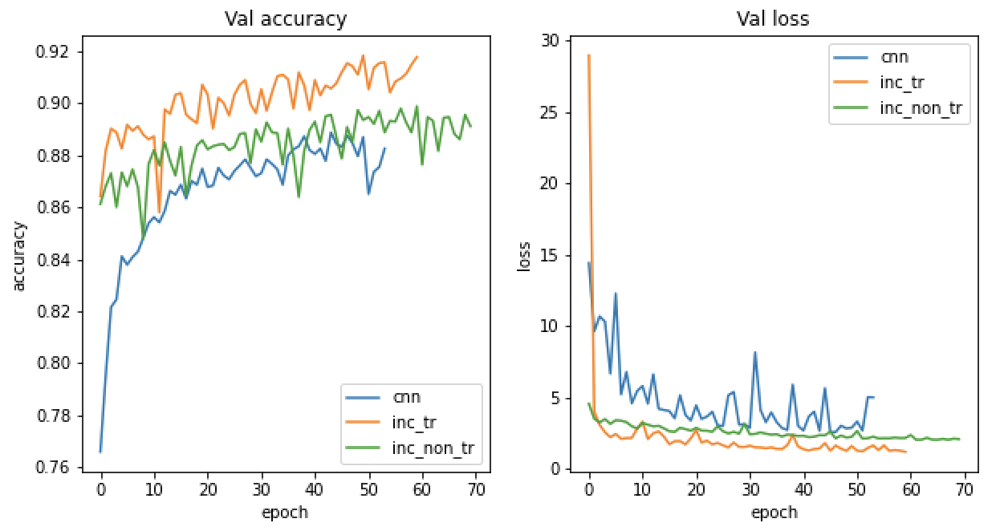 | 
|:--:| 
| Model performance over time|

From the table below we can see that CNN training loss is higher than the validation loss. This ambiguous behavior can be caused by dropout, which affects training loss only. We can also see that the Inception model with trained weights performs the best overall but still suffers from overfitting. One solution to this is to apply regularization to the hidden layer, which can improve performance but slow down convergence [^4].

| 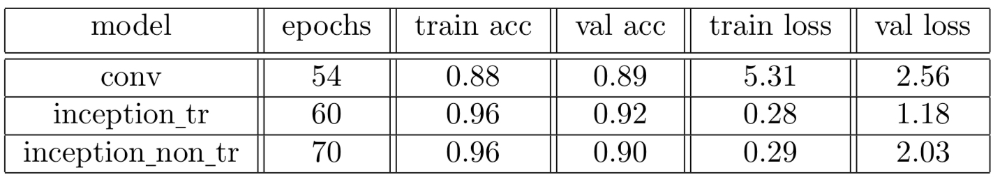 | 
|:--:| 
| Model accuracy comparison |

If we display the results of the prediction, we can see that, in general, the inc_tr model gives more plausible landmark locations.

|  | 
|:--:| 
| Comparison of predictions. From top to bottom: conv, inc tr, inc non tr |

Although the model makes fairly accurate predictions for most images, it still fails in some cases. For example, if the person on the photo is grimacing or some parts of the face are occluded. Some potential ways to solve this problem are to introduce more augmentations or collect more data if possible.

| 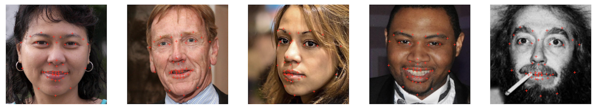 | 
|:--:| 
| Successful predictions |

| 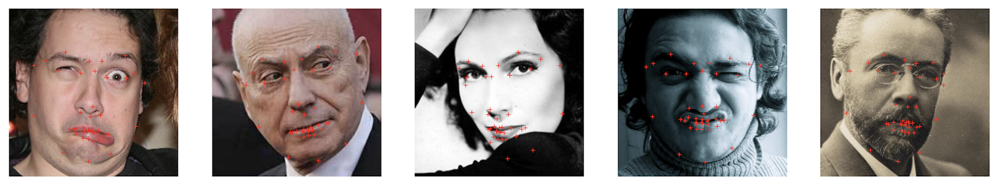 | 
|:--:| 
| Bad predictions |

## Lip/Eye Colour Modification

A simple algorithm that can be used to change lip color is described below.

| 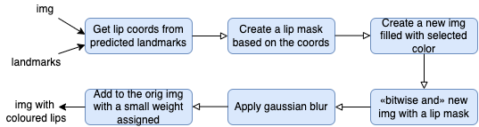 | 
|:--:| 
| Lip colour modification algorithm |

These are successful examples of using this approach:

| 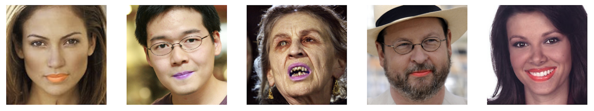 | 
|:--:| 
| Lip colouring successful cases |

Failure occurs when the predicted landmarks do not match the lip shape, for instance when the gums are predicted to be part of the lip. Because this method always tries to find a merged polygon defined by landmarks, it also doesn't work well with some occlusions (e.g. tongue). 

| 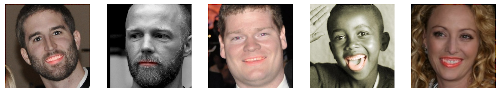 | 
|:--:| 
| Lip colouring faulty cases |

Changing the color of the eyes is a little trickier since we can't define a polygon around the iris the way we did with the lips.

| 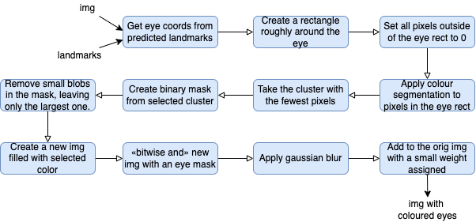 | 
|:--:| 
| Eye colour modification algorithm |

| 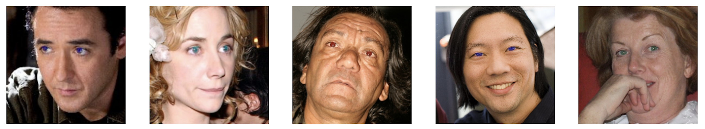 | 
|:--:| 
| Eye colouring successful cases |

However, this method often produces unstable results. Unlike the lip modification presented earlier, it relies on segmented pixels rather than a shape determined by predicted landmarks. Therefore, errors are likely to occur for people with darker skin tones, and results can often be affected by eyelashes and various reflections and shadows.

| 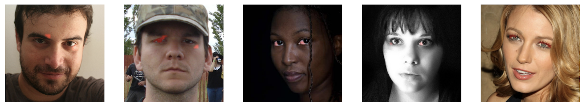 | 
|:--:| 
| Eye colouring faulty cases |

## Conclusion
We have demonstrated how the face alignment problem can be solved with a CNN and compared different network architectures. We found that the pre-trained Inception model with trainable weights performs the best, although sometimes it still makes incorrect predictions. Finally, we looked at how predicted landmarks can be used to change lip and eye color. However, the accuracy of these operations is highly dependent on the quality of the landmarks and external factors such as lighting conditions and person's face morphology.

This report discussed one possible approach for predicting facial landmarks. The results show that transfer learning using the Inception model is an efficient and reliable method for facial landmark detection. It does not claim to be the best solution to the problem, but it can provide a relatively robust framework for achieving good results.

[^1]: Xudong Cao, Yichen Wei, Fang Wen, and Jian Sun. Face alignment by explicit shape regression. Inter-
national journal of computer vision, 107(2):177–190, 2014.
[^2]: Vahid Kazemi and Josephine Sullivan. One millisecond face alignment with an ensemble of regression
trees. In Proceedings of the IEEE conference on computer vision and pattern recognition, pages 1867–
1874, 2014.
[^3]: Christian Szegedy, Wei Liu, Yangqing Jia, Pierre Sermanet, Scott Reed, Dragomir Anguelov, Dumitru
Erhan, Vincent Vanhoucke, and Andrew Rabinovich. Going deeper with convolutions. In Proceedings of
the IEEE conference on computer vision and pattern recognition, pages 1–9, 2015.
[^4]:Shutong Zhang and Chenyue Meng. Facial keypoints detection using neural network. Stanford Report,
1655:1655, 2016.
[^5]; Christian Szegedy, Vincent Vanhoucke, Sergey Ioffe, Jon Shlens, and Zbigniew Wojna. Rethinking the
inception architecture for computer vision. In Proceedings of the IEEE conference on computer vision
and pattern recognition, pages 2818–2826, 2016.

